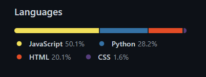
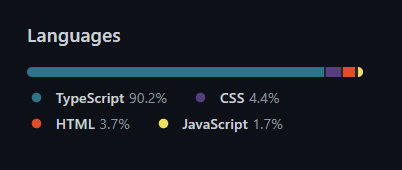

### Hello nice to meet ya! 👋

<!--
**ocskier/ocskier** is a ✨ _special_ ✨ repository because its `README.md` (this file) appears on your GitHub profile.
-->

My name is **Jon Jackson**. I have been in software development full-time since 2018,
utilizing my knowledge of engineering as well as information technology disciplines to gain
strong fundamentals in Javascript, Python, Typescript, HTML, and CSS. I have dual
B.S. degrees in Chemical Engineering and Wood and Paper Science from
[_NC State University_](https:ncsu.edu). In graduate school I obtained a
Computer Programming Certificate and a Masters in Wood and Paper Science. I have spent
many years teaching myself hardware and software fundamentals utilizing freelance work.
I spent time learning coding as well as building, repairing, and implementing personal
computers. Recently, I am employed with a coding education company teaching MERN stack
application development.

